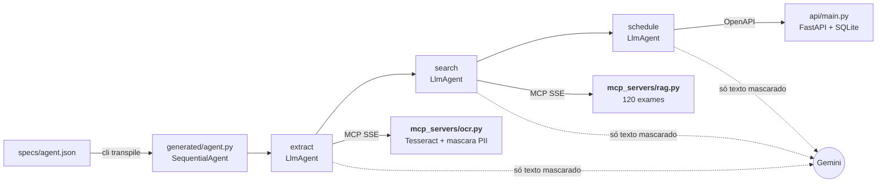

# Agendador de exames com Google ADK

Do pedido médico em foto ao agendamento confirmado. Um JSON descreve o agente, e o transpilador gera o código Google ADK que lê o pedido (OCR via MCP), acha os códigos dos exames (RAG via MCP), mascara os dados pessoais e agenda numa API FastAPI, tudo em Docker Compose.

É um projeto de estudo, pensado para servir de base a outros agentes Google ADK com MCP.

[](https://github.com/Cabraiz/rag-local-app/actions/workflows/ci.yml)    

### Rodar em 4 comandos
**Requer** Docker com Compose ≥ 2.1.1 e uma [chave Gemini](https://aistudio.google.com/apikey) (a gratuita serve: os dados são fictícios). Rode dentro do clone (`git clone https://github.com/Cabraiz/rag-local-app`), em PowerShell ou Git Bash. A API usa a porta 8765. Se algo falhar: [guia completo](docs/como-rodar.md#quando-algo-falha).

```bash
cp .env.example .env                                                     # preencha GOOGLE_API_KEY= (no Windows: notepad .env)
docker compose up -d --wait                                              # ocr, rag e api saudáveis (1º build, sem cache: 10 a 20 min)
docker compose run --rm agent python -m cli transpile specs/agent.json   # JSON → generated/agent.py, no volume Docker (1º build do agent, sem cache: 2 a 6 min)
docker compose run --rm agent python -m cli run --image pedido.png       # imagem de samples/, só pelo nome; OCR → RAG → agendamento (segundos a minutos, conforme a fila do Gemini)
```

Num terminal, a CLI mostra a lista e pergunta `Agendar estes N exames? [s/N]`. Para automação (sem terminal, CI), use `--yes`: sem pergunta, só agenda os exames bem lidos de páginas que as regras julgam limpas, só com a lista ([detalhe](docs/como-rodar.md#3-executar-o-agente)).

**Sua própria spec, sem rebuild:** salve-a em `specs/` e rode `docker compose run --rm agent python -m cli transpile specs/<sua-spec>.json` ([campos](docs/transpilador.md#campos-da-spec)). Um servidor fora do compose precisa estar em `ALLOWED_HOSTS`, como no [exemplo fora do domínio](specs/exemplo-generico.json): `-e ALLOWED_HOSTS=docs:8010`.

**Sem a CLI, com o próprio ADK:** `docker compose run --rm agent adk run --in_memory generated` e digite `pedido.png`; o `adk web` roda por `python -m runtime.web` ([como](docs/como-rodar.md#4-rodar-com-adk-run-ou-adk-web), [vídeo 12](docs/videos.md#12-adk-sem-a-cli)).

https://github.com/user-attachments/assets/2bf4ca61-0f7f-42d9-a174-16b3377d8f16

<sub>O fluxo completo em um vídeo, gravado numa execução real ([mp4](docs/gravacoes/00-visao-geral.mp4)).</sub>

### O que o sistema cobre
| Escopo do estudo | Onde | Prova |
|---|---|---|
| Transpilador: JSON → Python que instancia agentes só com o Google ADK (só classes do ADK; a política é um plugin do ADK) | [`transpiler/`](transpiler/), [`runtime/`](runtime/), [5 specs](specs/) | [vídeo 01](docs/videos.md#01-transpilador) · [testes](tests/test_transpiler.py) · [specs diferentes](tests/test_spec_generica.py) · [com `adk run`](tests/test_adk_run.py) · [doc](docs/transpilador.md) |
| Valida inputs, erros claros, código gerado executável e nas boas práticas do ADK | [`transpiler/spec.py`](transpiler/spec.py), [`transpiler/live.py`](transpiler/live.py), [`transpiler/generator.py`](transpiler/generator.py) | [erros reais](docs/transpilador.md#validação-e-mensagens-de-erro) · [código gerado](docs/exemplo-agent.py) |
| CLI de agendamento; entrada: imagem de pedido; JSON e imagem de exemplo | [`cli.py`](cli.py), [`specs/agent.json`](specs/agent.json), [`samples/pedido.png`](samples/pedido.png) | [log do `run`](docs/evidencias/log-run-pedido.txt) · [outra imagem](docs/como-rodar.md#testar-outra-imagem) |
| OCR e RAG (≥ 100 exames) como servidores MCP só via SSE; como iniciar e como o agente se conecta | [`mcp_servers/ocr.py`](mcp_servers/ocr.py), [`mcp_servers/rag.py`](mcp_servers/rag.py), [`data/exams.json`](data/exams.json) (120) | vídeos [02](docs/videos.md#02-ocr-via-mcp-sse) e [03](docs/videos.md#03-rag-via-mcp-sse) · [SSE](tests/test_mcp_sse.py) · [OCR](tests/test_ocr.py) · [RAG](tests/test_rag.py) · [como iniciar e conectar](docs/arquitetura.md#servidores-mcp) |
| Agendamento em FastAPI; Swagger (`/docs`) com o contrato que o agente consome | [`api/main.py`](api/main.py), [`api/crypto.py`](api/crypto.py) | [vídeo 04](docs/videos.md#04-api-e-swagger) · [API](tests/test_api.py) · [operações](docs/como-rodar.md#1-subir-o-ambiente-docker) |
| Saída: exames com códigos e confirmação da API; antes, a pessoa confirma a lista | [`cli.py`](cli.py), [`runtime/confirmacao.py`](runtime/confirmacao.py) | [vídeo 05](docs/videos.md#05-ponta-a-ponta-com-gemini) · [captura](docs/evidencias/cli-run-pedido.png) |
| Só dados fictícios | [`data/exams.json`](data/exams.json) (`FICT-xxx`), [`samples/`](samples/), [`tests/load/pedidos.py`](tests/load/pedidos.py) | e-mails `.invalid` (RFC 2606), CPFs com dígito verificador errado ([como](docs/medicoes.md#dados-sensíveis-como-contornamos)) |
| PII mascarada antes do LLM (por regras: [o que ainda passa](docs/decisoes.md#pii-mascarada-na-origem-banco-sem-pii)) e da persistência | [`guardrails/pii.py`](guardrails/pii.py), [`guardrails/injection.py`](guardrails/injection.py), [`guardrails/intent.py`](guardrails/intent.py) | vídeos [06](docs/videos.md#06-pii) e [08](docs/videos.md#08-segurança) · [PII](tests/test_pii.py) · [negação](tests/test_negacao.py) · [onde](docs/arquitetura.md#onde-a-pii-é-mascarada) · [carga](docs/medicoes.md#carga-de-dados-sensíveis) |
| Tudo em Docker, orquestrado por um `docker-compose.yml` | [`Dockerfile`](Dockerfile) (multi-stage), [`docker-compose.yml`](docker-compose.yml) | [vídeo 07](docs/videos.md#07-docker-e-testes) · [testes](docs/como-rodar.md#testes) |
| README, evidências e uso de IA | este arquivo, [`docs/evidencias/`](docs/evidencias/), [`docs/gravacoes/`](docs/gravacoes/) | [guia completo](docs/como-rodar.md) · [Evidências](#evidências) · [Uso de IA](#uso-de-ia) |

## Limites conhecidos

- **Busca lexical, não semântica.** Entende abreviações e erros de OCR nos 120 exames fictícios, não paráfrases; a semântica, medida, não agendou exame a mais ([medição](docs/medicoes.md#busca-semântica-avaliada-não-adotada)).
- **Letra de médico quase ilegível para o Tesseract.** Nos manuscritos simulados, ele agenda sozinho 1 de 206 exames, sem erro; um leitor de visão local aceitou 24%, mas é lento na CPU e não está ligado ([medição](docs/medicoes.md#letra-de-médico-leitor-local-avaliado-não-ligado-por-padrão), [em produção](docs/decisoes.md#pedido-em-papel-em-produção)).
- **Leitura fraca vira aviso.** Um exame lido certo numa linha que o OCR leu mal fica fora da pergunta; com uma imagem nova, o agendamento pode sair parcial ([exemplo](docs/decisoes.md#exame-lido-certo-mas-com-leitura-fraca-fica-fora-da-pergunta)).
- **Com `--yes`, um exame injetado como linha comum é agendado.** Sem `--yes`, a pessoa confirma a lista; com ele, só as regras decidem, e um carimbo que o OCR não lê passa ([o que passa](docs/decisoes.md#com---yes-um-exame-injetado-como-linha-comum-é-agendado)).
- **Filtros por regras não provam segurança contra ataques novos.** São testadas como regressão, em corpora do projeto; a barreira final é o callback, que só agenda códigos achados nas linhas lidas (um exame que o modelo associou mal ainda pode aparecer na lista, marcado `confira`) ([detalhe](docs/decisoes.md#filtros-determinísticos-não-são-prova-contra-ataques-novos)).
- **O `agent.py` instancia só classes do ADK; a política vem de um plugin do ADK versionado em `runtime/`.** Agentes, `App`, modelo e toolsets são do ADK (os toolsets por subclasses finas que conferem o host). O limite: o pacote `runtime/` precisa estar na imagem ([detalhe](docs/decisoes.md#o-agentpy-usa-só-classes-do-adk-a-política-mora-num-plugin-versionado)).
- **Sem autenticação na API nem entre serviços.** É um mock local: a API só publica porta em `127.0.0.1`; OCR e RAG não têm internet, mas o container da API tem, porque uma porta publicada exige uma rede não interna ([em produção](docs/decisoes.md#sem-autenticação-na-api-e-entre-serviços)).
- **Cadeia de suprimentos, em parte.** Faltam `--require-hashes` e versões fixas no `apt`, e o Swagger UI vem de um CDN em versão flutuante (@5), sem SRI ([detalhe](docs/decisoes.md#cadeia-de-suprimentos-em-parte)).

Versão longa: [decisões e limites](docs/decisoes.md#limites) · medidos: [medições](docs/medicoes.md#limites-conhecidos) · em aberto: [revisão](docs/revisao.md#ainda-em-aberto).

## Arquitetura em 1 minuto



O `up` sobe OCR, RAG e API; o agente roda sob demanda (`cli run`, ou `adk run` / `adk web`). Etapas, rede, MCP, PII e erros: [docs/arquitetura.md](docs/arquitetura.md).

## Decisões e trade-offs

Versão longa: [docs/decisoes.md](docs/decisoes.md).

- **O modelo propõe, o código decide, a pessoa confirma.** O Gemini lê as linhas de exame mascaradas, transforma a redação livre em buscas no catálogo e propõe os códigos; o código confere cada proposta contra o que foi lido e buscado e decide o que agenda, pergunta ou deixa de fora. Por quê: num pedido médico, a decisão precisa ser reprodutível e auditável ([detalhe](docs/decisoes.md#o-modelo-propõe-o-código-decide-a-pessoa-confirma)).
- **Confirmação final da lista, nativa do ADK.** A pessoa vê os exames com código e aviso, e o que ficou de fora, e responde `Agendar estes N exames? [s/N]`. Custo: um passo a mais em todo pedido ([detalhe](docs/decisoes.md#a-confirmação-final-da-lista)).
- **Uma camada de regras, porque a imagem não é confiável e o pedido é médico.** As regras dão o aviso de cada exame e, com `--yes`, só deixam agendar sozinha uma página que é só a lista; a confirmação da pessoa é a barreira final ([as 22 regras](docs/regras.md)).
- **PII mascarada na origem, banco sem PII.** Nome, CPF, telefone, e-mail e mais 10 tipos viram `[NOME]`, `[CPF]`… dentro do OCR; a API grava só códigos do catálogo, cifrados. Custo: regras, válidas para os formatos testados ([camadas](docs/arquitetura.md#segurança-em-detalhe)).
- **MCP só via SSE, rede interna, containers endurecidos.** OCR e RAG sem internet nem porta no host; containers sem root e somente leitura. Custo: o MCP trocou o SSE pelo Streamable HTTP ([detalhe](docs/decisoes.md#mcp-só-via-sse-rede-interna-containers-endurecidos)).
- **Transpilador estrito e genérico.** Tipos estritos, valores por `repr()`, arquivo importado antes do OK; o domínio fica num plugin, e uma spec fora do domínio também transpila ([detalhe](docs/decisoes.md#transpilador-estrito-e-genérico)).
- **`SequentialAgent`, obsoleto no ADK 2.10.** O `Workflow` ainda não é um `BaseAgent`. Custo: um aviso de depreciação e uma migração futura que mexe na CLI.

## Evidências

Execução real com `gemini-3.5-flash`. Vídeos 00 a 12: [miniaturas](docs/gravacoes/README.md) · [players](docs/videos.md).

- **Logs:** [`run` com `pedido.png`](docs/evidencias/log-run-pedido.txt) (com a linha `Tempo:`) · [alucinação com o Gemini real](docs/evidencias/log-alucinacao.txt) (o que o modelo pediu × o que foi agendado), além do teste roteirizado.
- **CLI:** [`transpile`](docs/evidencias/cli-transpile.png) · [`transpile` com erro claro](docs/evidencias/cli-transpile-erro.png) · [`run` com `pedido.png`](docs/evidencias/cli-run-pedido.png) · [injeção](docs/evidencias/cli-run-ataque.png) · [PII](docs/evidencias/cli-run-pii.png) · [manuscrito com `[s/N]`](docs/evidencias/cli-run-manuscrito.png) · [foto de celular](docs/evidencias/cli-run-foto-celular.png) · [`adk run`, sem a CLI](docs/evidencias/adk-run.png).
- **Swagger:** <http://127.0.0.1:8765/docs> (ou a porta de `API_PORT`; as capturas usam 18905) · [cada erro com o seu exemplo](docs/evidencias/swagger-docs.png) · [`POST /appointments` → 201](docs/evidencias/swagger-post-201.png).
- **Banco e Docker:** [lista de exames cifrada no SQLite, sem PII, lida de volta pela API](docs/evidencias/sqlite-cifrado.png) · [serviços healthy e testes](docs/evidencias/docker-testes.png).

## Uso de IA

- **Abordagem:** código escrito com Claude Code e OpenAI Codex sob minha direção. Arquitetura, contratos e critérios de aceite foram meus; cada mudança passou por revisão do diff, testes e execução real.
- **A revisão mudou o código:** ["TGP" lido "TAP" seria agendado](docs/revisao.md#tgp-tap), [exame repetido agendava o vizinho](docs/revisao.md#vizinho), [31 de 84 dados pessoais difíceis passavam](docs/revisao.md#pii-31). Cada achado e o teste que o trava: [docs/revisao.md](docs/revisao.md); o histórico é compactado por camada, então as correções não aparecem como commits próprios.
- **Referências:** [Google ADK](https://google.github.io/adk-docs/), [MCP: transporte HTTP+SSE](https://modelcontextprotocol.io/specification/2024-11-05/basic/transports), [Gemini API](https://ai.google.dev/gemini-api/docs) e a [lista completa](docs/revisao.md#referências-e-orquestração-do-agente).
- **Orquestração:** fluxo sequencial (`SequentialAgent`): `extract` (OCR) → `search` (RAG) → `schedule` (API). Cada etapa passa a saída pelo estado (`output_key`) e só vê as ferramentas que a spec lhe dá (`tool_filter`); o `BookingPlugin` do `App` confere cada chamada de modelo e de ferramenta.

## Mais documentação

- [Como rodar](docs/como-rodar.md): passo a passo, variáveis, erros e testes · [Arquitetura](docs/arquitetura.md): etapas, rede, MCP, PII e erros · [Decisões e limites](docs/decisoes.md)
- [Transpilador](docs/transpilador.md): spec, validação e código gerado · [Regras](docs/regras.md): as regras de página e de linha · [Números](docs/medicoes.md): medições e limites
- [Revisão](docs/revisao.md): o que mudou e o teste que trava cada correção · [Vídeos](docs/videos.md) · [licenças e dados](docs/licencas.md) · licença [MIT](LICENSE)
