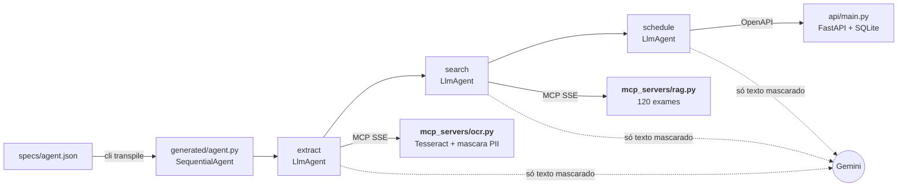

# Transpilador JSON → agente Google ADK (agendamento de exames)

**Um JSON descreve o agente; o transpilador gera o código Python Google ADK que lê o pedido médico (OCR via MCP), busca os códigos dos exames (RAG via MCP), mascara dados pessoais e agenda numa API FastAPI, tudo em Docker Compose.**

[](https://github.com/Cabraiz/rag-local-app/actions/workflows/challenge.yml)    

https://github.com/user-attachments/assets/a6e9fd9e-be6f-48ed-ba4e-356cc72f631b

<sub>Todos os pontos do desafio em um vídeo, gravado numa execução real ([mp4](videos-do-desafio/00-desafio-completo.mp4)).</sub>

### TL;DR

- **Transpilador:** [`specs/agent.json`](specs/agent.json) → `generated/agent.py`, compilado e importado antes do OK (fica no volume `generated`; cópia conferida por teste em [`docs/exemplo-agent.py`](docs/exemplo-agent.py)).
- **Spec genérica:** a spec declara os servidores (MCP ou OpenAPI), as ferramentas de cada agente e o papel de cada uma (ler, buscar, agendar); os hosts aceitos vêm de `ALLOWED_HOSTS`. Há 4 specs de exemplo em [`specs/`](specs/), e [`listar-exames.json`](specs/listar-exames.json) só lista os exames, sem agendar.
- **Só Google ADK:** os agentes são classes do ADK; [`runtime/`](runtime/) é a biblioteca de runtime do transpilador (interface 3), com os callbacks e utilitários que eles usam. [Um teste](tests/test_runtime.py) importa o `agent.py` e agenda por ele só com ela e o `catalogo.py`, fora do repositório.
- **OCR e RAG como servidores MCP, exclusivamente via SSE.** A base tem 120 exames fictícios; a busca é lexical (palavras em comum + `difflib`), determinística, sem embeddings ([por quê](docs/arquitetura.md#decisões-técnicas-em-detalhe)). Busca semântica avaliada e medida, não adotada: [ver medições](docs/medicoes.md#busca-semântica-avaliada-não-adotada).
- **Ponta a ponta:** imagem → OCR → RAG → `POST /appointments` → tabela exame → código e a confirmação da API.
- **PII mascarada dentro do OCR**, antes do LLM e do banco; os códigos são conferidos em código antes do `POST`.
- **Testes:** 374 funções (17,3 mil casos), ruff, mypy (checagem leve) e 98% de cobertura na CI ([números](docs/medicoes.md)). Rodar: `docker compose run --rm tests pytest -q -n auto`, cerca de 3,5 min em 12 núcleos, sempre sem a chave; o ponta a ponta real com o Gemini é à parte: `docker compose run --rm tests-e2e` ([testes](docs/como-rodar.md#testes)).

### Rodar em 4 comandos

- **Requer:** Docker com Compose ≥ 2.1.1 (Docker Desktop aberto no Windows e no macOS; Docker Engine no Linux) e uma [chave Gemini](https://aistudio.google.com/apikey); a gratuita basta, porque os dados são fictícios ([licenças e dados](docs/licencas.md#dados-e-ia)).
- **Pasta:** `git clone https://github.com/Cabraiz/rag-local-app`, depois `cd rag-local-app`; rode tudo ali. No Windows, use PowerShell ou Git Bash, não o `cmd.exe`; no Linux e no macOS, qualquer shell.
- **Porta:** a API usa a 8765 (outra em `API_PORT` no `.env`). Erros e variações: [guia completo](docs/como-rodar.md).

```bash
cp .env.example .env                                                     # preencha GOOGLE_API_KEY= (no Windows: notepad .env)
docker compose up -d --wait                                              # ocr, rag e api saudáveis (1º build: 10 a 20 min)
docker compose run --rm agent python -m cli transpile specs/agent.json   # JSON → generated/agent.py (o 1º constrói a imagem do agent: alguns minutos, 2 a 6)
docker compose run --rm agent python -m cli run --image pedido.png       # imagem de samples/, só pelo nome; OCR → RAG → agendamento (1 a 7 min, conforme a fila do Gemini)
```

Com o `up` no ar, o Swagger fica em <http://127.0.0.1:8765/docs> (ou na porta de `API_PORT`).

<details>
<summary>O <code>up</code> falhou com <code>all predefined address pools have been fully subnetted</code>?</summary>

Há projetos Docker demais na máquina. Crie na raiz um `docker-compose.override.yml` com duas faixas livres e rode o `up` de novo. As faixas abaixo são só exemplo; veja quais estão em uso com `docker network inspect $(docker network ls -q) --format "{{.Name}} {{range .IPAM.Config}}{{.Subnet}} {{end}}"` ([detalhes](docs/como-rodar.md#quando-algo-falha)).

```yaml
networks:
  default: {ipam: {config: [{subnet: 10.201.10.0/24}]}}
  internal: {ipam: {config: [{subnet: 10.201.11.0/24}]}}
```

</details>

Saída resumida dos dois últimos comandos. O `run` leva de 1 a 7 min, quase todo à espera do Gemini; nesse [log das evidências](evidencias/log-run-pedido.txt), 232 s:

```text
OK: generated/agent.py gerado e importado; root_agent "clinic_scheduler" (SequentialAgent: extract -> search -> schedule)
PII mascarada pelo OCR: NOME x2, CPF x1, EMAIL x1, TELEFONE x1
| Exame              | Código   |
|--------------------|----------|
| Hemograma completo | FICT-001 |
| Glicemia de jejum  | FICT-002 |
| Creatinina         | FICT-005 |
Agendamento confirmado pela API: id a05f0421…, status scheduled
Tempo: OCR 6,1 s · busca 35 s · agendamento 51 s · total 232 s (modelo gemini-3.5-flash)
```

O total inclui os turnos do Gemini ([como é medido](docs/como-rodar.md#3-executar-o-agente)). Um exame de confiança média gera `Incluir? [s/N]`, só num terminal interativo.

Para parar e limpar tudo, inclusive o banco e a chave dele: `docker compose --profile cli down -v`.

## Onde está cada parte

Cada requisito do enunciado, na ordem do PDF, com o código e uma prova que se abre com um clique.

| # | Requisito do enunciado | Código | Prova |
|---|---|---|---|
| 1 | Transpilador: JSON → Python que instancia agentes com o Google ADK; servidores, papéis e agentes vêm da spec | [`transpiler/`](transpiler/), [`runtime/`](runtime/), [4 specs](specs/) | [vídeo 01](docs/videos.md#01-transpilador) · [testes](tests/test_transpiler.py) · [specs diferentes](tests/test_spec_generica.py) · [doc](docs/transpilador.md) |
| 2 | Valida inputs e retorna erros claros; ferramentas conferidas nos servidores que respondem | [`transpiler/spec.py`](transpiler/spec.py), [`transpiler/live.py`](transpiler/live.py) | [erros reais](docs/transpilador.md#validação-e-mensagens-de-erro) |
| 3 | Código gerado executável e nas boas práticas do ADK | [`transpiler/generator.py`](transpiler/generator.py) | [código gerado](docs/exemplo-agent.py) · [como é gerado](docs/transpilador.md#geração) |
| 4 | Assistente CLI de agendamento | [`cli.py`](cli.py) | [como rodar](docs/como-rodar.md) |
| 5 | Entrada: imagem de pedido médico fictício | [`samples/`](samples/) ([`pedido.png`](samples/pedido.png) e variações) | [testar outra imagem](docs/como-rodar.md#testar-outra-imagem) |
| 6 | OCR via MCP com SSE | [`mcp_servers/ocr.py`](mcp_servers/ocr.py) | [vídeo 02](docs/videos.md#02-ocr-via-mcp-sse) · [SSE](tests/test_mcp_sse.py) · [OCR](tests/test_ocr.py) |
| 7 | RAG via MCP com SSE, ≥ 100 exames | [`mcp_servers/rag.py`](mcp_servers/rag.py), [`data/exams.json`](data/exams.json) (120) | [vídeo 03](docs/videos.md#03-rag-via-mcp-sse) · [testes](tests/test_rag.py) |
| 8 | Agendamento numa API FastAPI | [`api/main.py`](api/main.py), [`api/crypto.py`](api/crypto.py) | [vídeo 04](docs/videos.md#04-api-e-swagger) · [API](tests/test_api.py) · [cifra](tests/test_crypto.py) |
| 9 | Saída: exames com códigos e confirmação da API | [`cli.py`](cli.py) | [vídeo 05](docs/videos.md#05-ponta-a-ponta-com-gemini) · [saída esperada](#rodar-em-4-comandos) |
| 10 | Só dados fictícios | [`data/exams.json`](data/exams.json) (`FICT-xxx`), [`samples/`](samples/), [`tests/load/pedidos.py`](tests/load/pedidos.py) | `.invalid`, CPF inválido de propósito ([como](docs/medicoes.md#dados-sensíveis-como-contornamos)) |
| 11 | MCP exclusivamente via SSE; como iniciar e como o agente se conecta | [`mcp_servers/`](mcp_servers/), [`docker-compose.yml`](docker-compose.yml) | [Servidores MCP](docs/arquitetura.md#servidores-mcp) |
| 12 | Swagger (`/docs`) com o contrato que o agente consome | [`api/main.py`](api/main.py) | [URL e interface](#evidências) · [operações](docs/como-rodar.md#1-subir-o-ambiente-docker) |
| 13 | Camada de PII antes do LLM e da persistência (mais a neutralização de injeção) | [`guardrails/pii.py`](guardrails/pii.py), [`guardrails/injection.py`](guardrails/injection.py) | vídeos [06](docs/videos.md#06-pii) e [08](docs/videos.md#08-segurança) · [PII](tests/test_pii.py) · [injeção](tests/test_injection.py) · [onde](docs/arquitetura.md#onde-a-pii-é-mascarada) · [números](docs/medicoes.md) |
| 14 | Tudo em Docker, orquestrado por um `docker-compose.yml` | [`Dockerfile`](Dockerfile) (multi-stage), [`docker-compose.yml`](docker-compose.yml) | [vídeo 07](docs/videos.md#07-docker-e-testes) |
| 15 | JSON de exemplo e imagem de teste | [`specs/agent.json`](specs/agent.json), [`samples/pedido.png`](samples/pedido.png) | [Rodar em 4 comandos](#rodar-em-4-comandos) |
| 16 | README com Docker, transpilador e agente | este arquivo | [guia completo](docs/como-rodar.md) |
| 17 | Evidências: logs, prints da CLI, URL e interface do Swagger | [`videos-do-desafio/`](videos-do-desafio/), [`evidencias/`](evidencias/) | [Evidências](#evidências) |
| 18 | Uso de IA: abordagem, referências e orquestração | este arquivo | [Uso de IA](#uso-de-ia-e-processo-de-engenharia) |

## Arquitetura



O `docker compose up` sobe OCR e RAG como servidores MCP com SSE, em `http://ocr:8001/sse` e `http://rag:8002/sse` (rede interna, sem porta no host); o agente conecta com `McpToolset(SseConnectionParams(url=…))` e lê a API pelo `/openapi.json` ([servidores MCP](docs/arquitetura.md#servidores-mcp)). A spec escolhe os servidores, mas o host e a porta de cada URL precisam estar em `ALLOWED_HOSTS`, configurado por quem implanta: o padrão é `ocr:8001,rag:8002,api:8000`, só essas portas, e `localhost` ou `127.0.0.1` só entram se forem listados. No `transpile`, cada servidor que responde diz quais ferramentas tem, e uma que ele não tem é recusada; se ele não responder, vale a lista da spec ([por quê](docs/transpilador.md#campos-da-spec)). No `run`, todos precisam responder e listar as ferramentas, o `agent.py` precisa ser o que a spec gera hoje, e os toolsets conferem `ALLOWED_HOSTS` de novo ao importar. Etapas, rede, fluxo de dados, decisões técnicas e erros: [docs/arquitetura.md](docs/arquitetura.md).

## Segurança

- **PII mascarada na origem:** nome, CPF, telefone, e-mail e mais 10 tipos viram `[NOME]`, `[CPF]`… dentro do OCR, e só sai dele o que parece exame.
- **Injeção pelo texto da imagem** é tirada da linha. No corpus que nós geramos ([`tests/attacks/generate.py`](tests/attacks/generate.py)), 0 de 790 ataques passam intactos e 0 de 1.404 linhas legítimas (1.353 distintas) são removidas: é um teste de regressão, não prova de segurança.
- **Agendamento conferido em código** ([`runtime/`](runtime/callbacks.py)): só códigos buscados e presentes no pedido; ≥ 0,90 agenda, 0,70 a 0,90 pergunta `[s/N]`, abaixo avisa.
- **Foto ruim recusada antes do OCR**, com a dica do que fazer; uma página de lado é endireitada e lida.
- **Menor privilégio:** cada agente só vê as ferramentas que a spec lhe dá; containers sem root e somente leitura; OCR e RAG sem internet; só a API publica porta, em `127.0.0.1`.
- **Banco cifrado:** exames em AES-256-GCM, com a chave no volume `api-key`, que a API prepara ao subir; a chave Gemini só vai para os serviços `agent` e `tests-e2e`.
- **Limite por cliente na API:** 1200 requisições por minuto por IP (`API_RATE_LIMIT_PER_MINUTE`; 0 desliga); acima disso, `429` com `Retry-After`. `/health` fica de fora.

[Cada camada em detalhe](docs/arquitetura.md#segurança-em-detalhe).

## Leitura e robustez em números

- **Carga de 500 pedidos** fictícios que nós geramos, com 6.000 campos sensíveis: **0 vazamentos** no OCR e **0 valores em claro** no SQLite; 499 de 500 agendados. Vale para os formatos gerados: a máscara é por regras.
- **Exames errados agendados sem confirmação: 0** em 120 manuscritos simulados (114 de 497 exames, 23%, agendados sozinhos; letra de médico quase não é lida) e em 30 fotos de celular simuladas (92% dos exames agendados sozinhos).
- **Modelo que alucina** (roteirizado no lugar do Gemini, com os serviços reais): nada errado é agendado nem gravado.
- **Robustez:** 602 entradas faltando ou quebradas e **0 falhas** (nenhum erro 500, traceback ou PII).

Medido sem o Gemini. Os outros números, os comandos e os [limites](docs/medicoes.md#limites-conhecidos) estão em [docs/medicoes.md](docs/medicoes.md).

## Evidências

Execução real com `gemini-3.5-flash`.

| Evidência pedida | Arquivo |
|---|---|
| Log do `run` com `pedido.png` (com a linha `Tempo:`) | [`evidencias/log-run-pedido.txt`](evidencias/log-run-pedido.txt) |
| CLI: `transpile` | [`cli-transpile.png`](evidencias/cli-transpile.png) |
| CLI: `transpile` com erro claro | [`cli-transpile-erro.png`](evidencias/cli-transpile-erro.png) |
| CLI: `run` com `pedido.png` | [`cli-run-pedido.png`](evidencias/cli-run-pedido.png) |
| CLI: `run` com injeção | [`cli-run-ataque.png`](evidencias/cli-run-ataque.png) |
| CLI: `run` com PII | [`cli-run-pii.png`](evidencias/cli-run-pii.png) |
| PII persistida cifrada (SQLite) e lida de volta | [`sqlite-cifrado.png`](evidencias/sqlite-cifrado.png) |
| CLI: manuscrito com a pergunta `[s/N]` | [`cli-run-manuscrito.png`](evidencias/cli-run-manuscrito.png) |
| CLI: foto de celular | [`cli-run-foto-celular.png`](evidencias/cli-run-foto-celular.png) |
| Docker: serviços healthy e testes | [`docker-testes.png`](evidencias/docker-testes.png) |
| Alucinação: uma execução à parte com o Gemini real, além do teste roteirizado (o que o modelo pediu × o que foi agendado) | [`evidencias/log-alucinacao.txt`](evidencias/log-alucinacao.txt) |
| URL do Swagger | <http://127.0.0.1:8765/docs> (ou a de `API_PORT`; as capturas usam 18904) |
| Interface do Swagger | [`swagger-docs.png`](evidencias/swagger-docs.png) · `POST /appointments` → 201: [`swagger-post-201.png`](evidencias/swagger-post-201.png) |
| Vídeos 01 a 11 | [lista com miniaturas](videos-do-desafio/README.md) · [players](docs/videos.md) |

## Uso de IA e processo de engenharia

- **Abordagem:** código escrito com Claude Code e OpenAI Codex sob minha direção; arquitetura, contratos e critérios de aceite foram meus, e cada mudança passou por revisão do diff, testes e execução real.
- **A revisão mudou o código:** ["TGP" lido "TAP" seria agendado](docs/revisao.md#tgp-tap), [exame repetido agendava o vizinho](docs/revisao.md#vizinho), [31 de 84 dados pessoais difíceis passavam](docs/revisao.md#pii-31); 24 correções, 23 travadas por um teste: [docs/revisao.md](docs/revisao.md).
- **Referências:** [Google ADK](https://google.github.io/adk-docs/), [MCP: transporte HTTP+SSE](https://modelcontextprotocol.io/specification/2024-11-05/basic/transports), [Gemini API](https://ai.google.dev/gemini-api/docs) e a [lista completa](docs/revisao.md#referências-e-orquestração-do-agente).
- **Orquestração:** `SequentialAgent` com `extract` (OCR) → `search` (RAG) → `schedule` (API), em ordem fixa porque cada etapa depende da anterior; cada uma passa a saída pelo estado (`output_key`) e só vê as ferramentas que a spec lhe dá (`tool_filter`). O `SequentialAgent` está obsoleto no ADK 2.10, em favor de `Workflow`; mantive porque `Workflow` ainda não é um `BaseAgent` ([por quê](docs/arquitetura.md#decisões-técnicas-em-detalhe)).

## Mais documentação

- [Como rodar](docs/como-rodar.md): pré-requisitos, portas, outra imagem, erros e testes
- [Arquitetura](docs/arquitetura.md): etapas, rede, MCP, fluxo de dados, PII, decisões técnicas e erros
- [Transpilador](docs/transpilador.md): campos da spec, validação e código gerado
- [Números](docs/medicoes.md): carga, manuscritos, fotos, PII, robustez, calibração e limites
- [Revisão](docs/revisao.md): o que mudou, o teste que trava cada correção e as referências
- [Vídeos](docs/videos.md) · [licenças e dados](docs/licencas.md) · licença [MIT](LICENSE)
