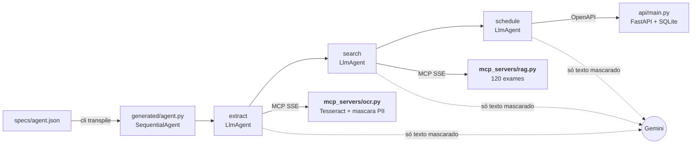

# Transpilador JSON → agente Google ADK (agendamento de exames)

**Um JSON descreve o agente; o transpilador gera o código Python Google ADK que lê o pedido médico (OCR via MCP), busca os códigos dos exames (RAG via MCP), mascara dados pessoais e agenda numa API FastAPI, tudo em Docker Compose.**

[](https://github.com/Cabraiz/rag-local-app/actions/workflows/challenge.yml)    

### Rodar em 4 comandos
**Requer** Docker com Compose ≥ 2.1.1 e uma [chave Gemini](https://aistudio.google.com/apikey) (a gratuita serve: os dados são fictícios). Rode dentro do clone (`git clone https://github.com/Cabraiz/rag-local-app`), em PowerShell ou Git Bash. A API usa a porta 8765. Se algo falhar: [guia completo](docs/como-rodar.md#quando-algo-falha).

```bash
cp .env.example .env                                                     # preencha GOOGLE_API_KEY= (no Windows: notepad .env)
docker compose up -d --wait                                              # ocr, rag e api saudáveis (1º build, sem cache: 10 a 20 min)
docker compose run --rm agent python -m cli transpile specs/agent.json   # JSON → generated/agent.py, no volume Docker (1º build do agent, sem cache: 2 a 6 min)
docker compose run --rm agent python -m cli run --image pedido.png       # imagem de samples/, só pelo nome; OCR → RAG → agendamento (1 a 7 min, conforme a fila do Gemini)
```

**Sua própria spec, sem rebuild:** salve-a em `specs/`, montada só para leitura no `agent`, e rode `docker compose run --rm agent python -m cli transpile specs/<sua-spec>.json` ([campos da spec](docs/transpilador.md#campos-da-spec)).

**Sem a CLI, com o próprio ADK:** `docker compose run --rm agent adk run --in_memory generated` e digite `pedido.png`; o `adk web` também funciona ([como](docs/como-rodar.md#4-rodar-com-adk-run-ou-adk-web)).

https://github.com/user-attachments/assets/a6e9fd9e-be6f-48ed-ba4e-356cc72f631b

<sub>Todos os pontos do desafio em um vídeo, gravado numa execução real ([mp4](videos-do-desafio/00-desafio-completo.mp4)).</sub>

### Onde está cada requisito
| Requisito do enunciado | Onde | Prova |
|---|---|---|
| Transpilador: JSON → Python que instancia agentes só com o Google ADK | [`transpiler/`](transpiler/), [`runtime/`](runtime/), [4 specs](specs/) | [vídeo 01](docs/videos.md#01-transpilador) · [testes](tests/test_transpiler.py) · [specs diferentes](tests/test_spec_generica.py) · [com `adk run`](tests/test_adk_run.py) · [doc](docs/transpilador.md) |
| Valida inputs, erros claros, código gerado executável e nas boas práticas do ADK | [`transpiler/spec.py`](transpiler/spec.py), [`transpiler/live.py`](transpiler/live.py), [`transpiler/generator.py`](transpiler/generator.py) | [erros reais](docs/transpilador.md#validação-e-mensagens-de-erro) · [código gerado](docs/exemplo-agent.py) |
| CLI de agendamento; entrada: imagem de pedido; JSON e imagem de exemplo | [`cli.py`](cli.py), [`specs/agent.json`](specs/agent.json), [`samples/pedido.png`](samples/pedido.png) | [log do `run`](evidencias/log-run-pedido.txt) · [outra imagem](docs/como-rodar.md#testar-outra-imagem) |
| OCR e RAG (≥ 100 exames) como servidores MCP só via SSE; como iniciar e como o agente se conecta | [`mcp_servers/ocr.py`](mcp_servers/ocr.py), [`mcp_servers/rag.py`](mcp_servers/rag.py), [`data/exams.json`](data/exams.json) (120) | vídeos [02](docs/videos.md#02-ocr-via-mcp-sse) e [03](docs/videos.md#03-rag-via-mcp-sse) · [SSE](tests/test_mcp_sse.py) · [OCR](tests/test_ocr.py) · [RAG](tests/test_rag.py) · [como iniciar e conectar](docs/arquitetura.md#servidores-mcp) |
| Agendamento em FastAPI; Swagger (`/docs`) com o contrato que o agente consome | [`api/main.py`](api/main.py), [`api/crypto.py`](api/crypto.py) | [vídeo 04](docs/videos.md#04-api-e-swagger) · [API](tests/test_api.py) · [operações](docs/como-rodar.md#1-subir-o-ambiente-docker) |
| Saída: exames com códigos e confirmação da API | [`cli.py`](cli.py) | [vídeo 05](docs/videos.md#05-ponta-a-ponta-com-gemini) · [captura](evidencias/cli-run-pedido.png) |
| Só dados fictícios | [`data/exams.json`](data/exams.json) (`FICT-xxx`), [`samples/`](samples/), [`tests/load/pedidos.py`](tests/load/pedidos.py) | e-mails `.invalid` (RFC 2606), CPFs com dígito verificador errado ([como](docs/medicoes.md#dados-sensíveis-como-contornamos)) |
| PII mascarada antes do LLM e da persistência | [`guardrails/pii.py`](guardrails/pii.py), [`guardrails/injection.py`](guardrails/injection.py), [`guardrails/intent.py`](guardrails/intent.py) | vídeos [06](docs/videos.md#06-pii) e [08](docs/videos.md#08-segurança) · [PII](tests/test_pii.py) · [negação](tests/test_negacao.py) · [onde](docs/arquitetura.md#onde-a-pii-é-mascarada) · [carga](docs/medicoes.md#carga-de-dados-sensíveis) |
| Tudo em Docker, orquestrado por um `docker-compose.yml` | [`Dockerfile`](Dockerfile) (multi-stage), [`docker-compose.yml`](docker-compose.yml) | [vídeo 07](docs/videos.md#07-docker-e-testes) · [testes](docs/como-rodar.md#testes) |
| README, evidências e uso de IA | este arquivo, [`evidencias/`](evidencias/), [`videos-do-desafio/`](videos-do-desafio/) | [guia completo](docs/como-rodar.md) · [Evidências](#evidências) · [Uso de IA](#uso-de-ia) |

## Limites conhecidos

- **Busca lexical, não semântica, por escolha.** Ela entende abreviações e erros de OCR, mas não paráfrases ("exame de açúcar no sangue"). A busca semântica foi medida e não agendou nenhum exame a mais ([medição](docs/medicoes.md#busca-semântica-avaliada-não-adotada)).
- **Letra de médico é o ponto fraco do OCR, e só foi medida em simulação.** Os 120 manuscritos usam fontes de letra de mão, não escrita real. Na letra de médico, 1 de 206 exames é agendado sem perguntar; o resto vira pergunta, `baixa confiança` ou não é lido, e nenhum errado é agendado sozinho ([medição](docs/medicoes.md#pedidos-manuscritos-simulados)).
- **Os filtros determinísticos não são prova contra ataques novos.** A máscara de PII e a remoção de injeção são regras, testadas em corpora do próprio projeto (790 ataques e 1.404 linhas legítimas, 1.353 distintas): é teste de regressão. A última barreira é o callback do agendamento: só passam códigos que a busca devolveu, ancorados nas linhas lidas, e sem a leitura do OCR por linha nada é agendado sem um "sim" (falha fechado).
- **Exame injetado como uma linha comum de exame é agendado.** Uma linha que só diz "Ferritina", no meio da lista, é indistinguível de um pedido real; o mesmo vale para um nome de exame dentro da assinatura. O resto vira aviso ou pergunta, nunca agendamento sozinho: ordens ao modelo, códigos `FICT` escritos na imagem, exames fora das linhas lidas, linhas que dizem para não fazer ou que o exame já foi feito, e texto que não é exame antes dele (em `Exame: Vitamina D (incluir também Ferritina)`, a Vitamina D é agendada e a Ferritina, perguntada) ([regra](docs/arquitetura.md#segurança-em-detalhe)).
- **O `agent.py` não é só ADK.** Agentes e toolsets são classes do ADK, e ele roda sozinho com `adk run` e `adk web`, sem a CLI. Mas as regras (callbacks de agendamento, hosts permitidos, pergunta `[s/N]`) vêm da biblioteca versionada do projeto, [`runtime/`](runtime/), que precisa estar na imagem. O modelo reserva, a linha `Tempo:` e a checagem de que o `agent.py` é o que a spec gera ficam só na CLI ([detalhes](docs/como-rodar.md#4-rodar-com-adk-run-ou-adk-web)).
- **API sem autenticação.** É o mock local do enunciado: escuta só em `127.0.0.1`, com limite de requisições por IP. Em produção, entraria OAuth2 ou uma chave de API.
- **Histórico compactado por camada.** Os commits agrupam o trabalho por camada (API, RAG, PII, OCR, runtime, transpilador, CLI, Docker, testes, docs); as correções não aparecem uma a uma. [docs/revisao.md](docs/revisao.md) liga cada correção ao teste que a trava.

Todos os limites: [medições](docs/medicoes.md#limites-conhecidos) e [revisão](docs/revisao.md#ainda-em-aberto).

## Arquitetura em 1 minuto



O `up` sobe OCR, RAG e API; o agente roda sob demanda (`cli run`, ou `adk run` / `adk web`). Etapas, rede, MCP, PII e erros: [docs/arquitetura.md](docs/arquitetura.md).

## Decisões e trade-offs

Cada uma: escolha → por quê → custo.

- **O modelo propõe, o código decide.** Os callbacks de [`runtime/`](runtime/callbacks.py) só aceitam códigos que a busca devolveu, cada um num trecho próprio do pedido; ≥ 0,90 agenda, 0,70 a 0,90 pergunta `[s/N]`, abaixo só avisa. Uma linha que diz para não fazer o exame, que ele já foi feito ou que só o comenta nunca agenda sozinha: vira aviso ou pergunta. Por quê: um LLM nunca deve ser a última barreira de um agendamento médico. Custo: um exame mal lido não agenda sozinho; vira pergunta ou aviso ([detalhe](docs/arquitetura.md#agendamento-conferido-em-código)).
- **Busca lexical (palavras em comum + `difflib`), sem embeddings.** Por quê: a base tem 120 exames fictícios, a busca é determinística e explicável (cada resultado diz o termo que deu o score), e a semântica, medida, não agendou nenhum exame a mais. Custo: não entende paráfrases ([medição](docs/medicoes.md#busca-semântica-avaliada-não-adotada)).
- **Filtros determinísticos dentro do OCR, antes de qualquer modelo.** A máscara deixa sair só o que parece exame, e a injeção é tirada da linha. Por quê: a falha fica local, reproduzível e testável, sem depender do prompt. Custo: manter regras, mitigado por corpora de regressão (3.600 casos gerados de PII, 790 ataques).
- **PII mascarada na origem, banco sem PII.** Nome, CPF, telefone, e-mail e mais 10 tipos viram `[NOME]`, `[CPF]`… no container do OCR; a API só aceita código e nome de exame, grava o nome do catálogo e cifra a lista (AES-256-GCM). Por quê: o LLM nunca vê o dado bruto, e o banco não depende da máscara. Custo: detecção por regras, válida para os formatos testados ([camadas](docs/arquitetura.md#segurança-em-detalhe)).
- **MCP só via SSE, rede interna, containers endurecidos.** OCR e RAG não têm internet nem porta no host; containers sem root, somente leitura e sem capabilities; só a API publica porta, em `127.0.0.1`. Por quê: o enunciado pede SSE, e cada serviço só tem o que usa. Custo: a especificação 2025-03-26 do MCP trocou o SSE pelo Streamable HTTP; mudar é trocar a conexão no template e o `run` dos servidores.
- **Transpilador estrito, com ferramentas conferidas ao vivo.** Pydantic com campos extras proibidos e tipos estritos, valores da spec entram por `repr()`, o arquivo é compilado e importado antes do OK, e cada servidor que responde confirma as ferramentas. Por quê: o erro aparece no `transpile`, com campo e motivo, não no meio de um agendamento. Custo: a spec descreve agentes em sequência com as ferramentas permitidas, não qualquer agente ([validação](docs/transpilador.md#validação-e-mensagens-de-erro)).
- **Biblioteca de runtime versionada, não a política copiada em cada arquivo.** O `agent.py` (cerca de 100 linhas) só declara os agentes e confere `API_VERSION` ao importar. Por quê: a regra é testada uma vez, para toda spec. Custo: o arquivo gerado depende de `runtime/` ([decisão](docs/arquitetura.md#decisões-técnicas-em-detalhe)).
- **`SequentialAgent`, obsoleto no ADK 2.10.** Ordem fixa `extract` → `search` → `schedule`, porque cada etapa depende da anterior. Mantido porque `Workflow` ainda não é um `BaseAgent`, e a CLI trata o agente raiz como um. Custo: um aviso de depreciação e uma migração futura que mexe também na CLI.

## Evidências

Execução real com `gemini-3.5-flash`. Vídeos 01 a 11: [miniaturas](videos-do-desafio/README.md) · [players](docs/videos.md).

- **Logs:** [`run` com `pedido.png`](evidencias/log-run-pedido.txt) (com a linha `Tempo:`) · [alucinação com o Gemini real](evidencias/log-alucinacao.txt) (o que o modelo pediu × o que foi agendado), além do teste roteirizado.
- **CLI:** [`transpile`](evidencias/cli-transpile.png) · [`transpile` com erro claro](evidencias/cli-transpile-erro.png) · [`run` com `pedido.png`](evidencias/cli-run-pedido.png) · [injeção](evidencias/cli-run-ataque.png) · [PII](evidencias/cli-run-pii.png) · [manuscrito com `[s/N]`](evidencias/cli-run-manuscrito.png) · [foto de celular](evidencias/cli-run-foto-celular.png).
- **Swagger:** <http://127.0.0.1:8765/docs> (ou a porta de `API_PORT`; as capturas usam 18904) · [interface](evidencias/swagger-docs.png) · [`POST /appointments` → 201](evidencias/swagger-post-201.png).
- **Banco e Docker:** [lista de exames cifrada no SQLite, sem PII, lida de volta pela API](evidencias/sqlite-cifrado.png) · [serviços healthy e testes](evidencias/docker-testes.png).

## Uso de IA

- **Abordagem:** código escrito com Claude Code e OpenAI Codex sob minha direção. Arquitetura, contratos e critérios de aceite foram meus; cada mudança passou por revisão do diff, testes e execução real.
- **A revisão mudou o código:** ["TGP" lido "TAP" seria agendado](docs/revisao.md#tgp-tap), [exame repetido agendava o vizinho](docs/revisao.md#vizinho), [31 de 84 dados pessoais difíceis passavam](docs/revisao.md#pii-31). Cada achado e o teste que o trava: [docs/revisao.md](docs/revisao.md).
- **Referências:** [Google ADK](https://google.github.io/adk-docs/), [MCP: transporte HTTP+SSE](https://modelcontextprotocol.io/specification/2024-11-05/basic/transports), [Gemini API](https://ai.google.dev/gemini-api/docs) e a [lista completa](docs/revisao.md#referências-e-orquestração-do-agente).
- **Orquestração:** fluxo sequencial (`SequentialAgent`): `extract` (OCR) → `search` (RAG) → `schedule` (API). Cada etapa passa a saída pelo estado (`output_key`) e só vê as ferramentas que a spec lhe dá (`tool_filter`).

## Mais documentação

- [Como rodar](docs/como-rodar.md): pré-requisitos, saída esperada, variáveis, erros e testes · [Arquitetura](docs/arquitetura.md): etapas, rede, MCP, PII, decisões e erros
- [Transpilador](docs/transpilador.md): spec, validação e código gerado · [Números](docs/medicoes.md): carga, manuscritos, fotos, robustez, calibração e limites
- [Revisão](docs/revisao.md): o que mudou e o teste que trava cada correção · [Vídeos](docs/videos.md) · [licenças e dados](docs/licencas.md) · licença [MIT](LICENSE)
