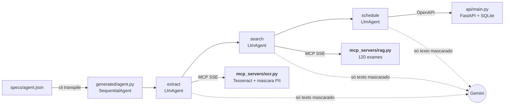

# Agendador de exames com Google ADK

Do pedido médico em foto ao agendamento confirmado. Um JSON descreve o agente, e o transpilador gera o código Google ADK que lê o pedido (OCR via MCP), acha os códigos dos exames (RAG via MCP), mascara os dados pessoais e agenda numa API FastAPI, tudo em Docker Compose.

É um projeto de estudo, pensado para servir de base a outros agentes Google ADK com MCP.

[](https://github.com/Cabraiz/rag-local-app/actions/workflows/ci.yml)    

### Rodar em 4 comandos
**Requer** Docker com Compose ≥ 2.1.1 e uma [chave Gemini](https://aistudio.google.com/apikey) (a gratuita serve: os dados são fictícios). Rode dentro do clone (`git clone https://github.com/Cabraiz/rag-local-app`), em PowerShell ou Git Bash. A API usa a porta 8765. Se algo falhar: [guia completo](docs/como-rodar.md#quando-algo-falha).

```bash
cp .env.example .env                                                     # preencha GOOGLE_API_KEY= (no Windows: notepad .env)
docker compose up -d --wait                                              # ocr, rag e api saudáveis (1º build, sem cache: 10 a 20 min)
docker compose run --rm agent python -m cli transpile specs/agent.json   # JSON → generated/agent.py, no volume Docker (1º build do agent, sem cache: 2 a 6 min)
docker compose run --rm agent python -m cli run --image pedido.png       # imagem de samples/, só pelo nome; OCR → RAG → agendamento (segundos a minutos, conforme a fila do Gemini)
```

**Sua própria spec, sem rebuild:** salve-a em `specs/`, montada só para leitura no `agent`, e rode `docker compose run --rm agent python -m cli transpile specs/<sua-spec>.json` ([campos da spec](docs/transpilador.md#campos-da-spec)).

**Sem a CLI, com o próprio ADK:** `docker compose run --rm agent adk run --in_memory generated` e digite `pedido.png`; o `adk web` também, por `python -m runtime.web`, que confere o `Host` contra DNS rebinding ([como](docs/como-rodar.md#4-rodar-com-adk-run-ou-adk-web), [vídeo 12](docs/videos.md#12-adk-sem-a-cli)).

https://github.com/user-attachments/assets/2bf4ca61-0f7f-42d9-a174-16b3377d8f16

<sub>O fluxo completo em um vídeo, gravado numa execução real ([mp4](docs/gravacoes/00-visao-geral.mp4)).</sub>

### O que o sistema cobre
| Escopo do estudo | Onde | Prova |
|---|---|---|
| Transpilador: JSON → Python que instancia agentes só com o Google ADK | [`transpiler/`](transpiler/), [`runtime/`](runtime/), [5 specs](specs/) | [vídeo 01](docs/videos.md#01-transpilador) · [testes](tests/test_transpiler.py) · [specs diferentes](tests/test_spec_generica.py) · [com `adk run`](tests/test_adk_run.py) · [doc](docs/transpilador.md) |
| Valida inputs, erros claros, código gerado executável e nas boas práticas do ADK | [`transpiler/spec.py`](transpiler/spec.py), [`transpiler/live.py`](transpiler/live.py), [`transpiler/generator.py`](transpiler/generator.py) | [erros reais](docs/transpilador.md#validação-e-mensagens-de-erro) · [código gerado](docs/exemplo-agent.py) |
| CLI de agendamento; entrada: imagem de pedido; JSON e imagem de exemplo | [`cli.py`](cli.py), [`specs/agent.json`](specs/agent.json), [`samples/pedido.png`](samples/pedido.png) | [log do `run`](docs/evidencias/log-run-pedido.txt) · [outra imagem](docs/como-rodar.md#testar-outra-imagem) |
| OCR e RAG (≥ 100 exames) como servidores MCP só via SSE; como iniciar e como o agente se conecta | [`mcp_servers/ocr.py`](mcp_servers/ocr.py), [`mcp_servers/rag.py`](mcp_servers/rag.py), [`data/exams.json`](data/exams.json) (120) | vídeos [02](docs/videos.md#02-ocr-via-mcp-sse) e [03](docs/videos.md#03-rag-via-mcp-sse) · [SSE](tests/test_mcp_sse.py) · [OCR](tests/test_ocr.py) · [RAG](tests/test_rag.py) · [como iniciar e conectar](docs/arquitetura.md#servidores-mcp) |
| Agendamento em FastAPI; Swagger (`/docs`) com o contrato que o agente consome | [`api/main.py`](api/main.py), [`api/crypto.py`](api/crypto.py) | [vídeo 04](docs/videos.md#04-api-e-swagger) · [API](tests/test_api.py) · [operações](docs/como-rodar.md#1-subir-o-ambiente-docker) |
| Saída: exames com códigos e confirmação da API; antes, a pessoa confirma a lista | [`cli.py`](cli.py), [`runtime/confirmacao.py`](runtime/confirmacao.py) | [vídeo 05](docs/videos.md#05-ponta-a-ponta-com-gemini) · [captura](docs/evidencias/cli-run-pedido.png) |
| Só dados fictícios | [`data/exams.json`](data/exams.json) (`FICT-xxx`), [`samples/`](samples/), [`tests/load/pedidos.py`](tests/load/pedidos.py) | e-mails `.invalid` (RFC 2606), CPFs com dígito verificador errado ([como](docs/medicoes.md#dados-sensíveis-como-contornamos)) |
| PII mascarada antes do LLM (por regras: [o que ainda passa](#decisões-e-trade-offs)) e da persistência | [`guardrails/pii.py`](guardrails/pii.py), [`guardrails/injection.py`](guardrails/injection.py), [`guardrails/intent.py`](guardrails/intent.py) | vídeos [06](docs/videos.md#06-pii) e [08](docs/videos.md#08-segurança) · [PII](tests/test_pii.py) · [negação](tests/test_negacao.py) · [onde](docs/arquitetura.md#onde-a-pii-é-mascarada) · [carga](docs/medicoes.md#carga-de-dados-sensíveis) |
| Tudo em Docker, orquestrado por um `docker-compose.yml` | [`Dockerfile`](Dockerfile) (multi-stage), [`docker-compose.yml`](docker-compose.yml) | [vídeo 07](docs/videos.md#07-docker-e-testes) · [testes](docs/como-rodar.md#testes) |
| README, evidências e uso de IA | este arquivo, [`docs/evidencias/`](docs/evidencias/), [`docs/gravacoes/`](docs/gravacoes/) | [guia completo](docs/como-rodar.md) · [Evidências](#evidências) · [Uso de IA](#uso-de-ia) |

## Limites conhecidos

- **Busca lexical, não semântica, por escolha.** Ela entende abreviações e erros de OCR, mas não paráfrases ("exame de açúcar no sangue"). A busca semântica foi medida e não agendou nenhum exame a mais ([medição](docs/medicoes.md#busca-semântica-avaliada-não-adotada)).
- **Letra de médico: medida, e com caminho para ser lida.** Os 120 manuscritos usam fontes de letra de mão, não escrita real. Na letra de médico, o Tesseract (padrão, leve) agenda sozinho 1 de 206 exames, sem nenhum errado ([medição](docs/medicoes.md#pedidos-manuscritos-simulados)). Um leitor de visão local, sem internet (Qwen3-VL 2B), aceitou 48 de 202 (24%) sem nenhum errado (na letra comum, 90%, contra 36% do Tesseract), igual nas duas rodadas, mas leva 14 a 24 s por página na CPU e, numa foto real, não aceitou nenhum dos 5 exames; está avaliado, não ligado ([medição](docs/medicoes.md#letra-de-médico-leitor-local-avaliado-não-ligado-por-padrão)). Com GPU, ajuste fino em pedidos reais ou um modelo em nuvem sob contrato de dados, basta trocar o leitor: o modelo só propõe, e o que não é certo vai para conferência.
- **Os filtros determinísticos não são prova contra ataques novos.** A máscara de PII e a remoção de injeção são regras, testadas em corpora do próprio projeto (790 ataques e 1.482 linhas legítimas, 1.429 distintas): é teste de regressão. A última barreira é o callback do agendamento: só passam códigos que a busca devolveu, ancorados nas linhas lidas (no nome mais longo do catálogo escrito ali: "Proteína C" dentro de "Proteína C reativa" é perguntada), e sem a leitura do OCR por linha nada é agendado sem um "sim" (falha fechado).
- **Com `--yes`, exame injetado como uma linha comum de exame é agendado.** Sem `--yes`, a pessoa vê a lista inteira e confirma antes de agendar; com ele, as regras abaixo são a única barreira. Numa página que é só a lista, uma linha que só diz "Ferritina" é indistinguível de um pedido real e agenda sozinha. Qualquer texto além da lista (fora campos, assinatura e timbre) faz a página inteira ser perguntada, inclusive um legítimo: uma observação de preparo com outras palavras, um cabeçalho que as regras não conhecem um erro de OCR na letra de mão ou uma assinatura à mão que o OCR lê como texto abaixo da lista ([medição](docs/medicoes.md#lista-branca-por-página)).
- **O que ainda passa pela lista branca da página, com `--yes`.** A regra só vê o texto que o Tesseract lê: um carimbo, uma nota na vertical ou em diagonal, um risco à mão ou uma letra clara demais deixam o exame como linha comum (a letra cinza que ele lê, menor ou mais clara que a da página, é pega). Um teste da tinta que o OCR não leu (cor saturada, tinta escura fora das caixas das palavras) pegaria os 4 carimbos e notas giradas de uma revisão, mas disparou em 30 de 30 fotos e 110 de 120 manuscritas, e ficou de fora ([medição](docs/medicoes.md#rodapé-formulário-nome-e-nome-mais-longo)). Abaixo do 1º exame, qualquer texto que a máscara tira ou não reconhece faz a página ser perguntada, em qualquer língua, menos uma assinatura que é só nome, CRM e data; acima da lista, uma linha tirada inteira só conta como timbre se parece um (clínica, hospital ou laboratório, endereço, telefone, CNPJ, CRM, "Receituário" ou data) e está separada da lista por um campo ("Paciente:"): uma nota que traga uma dessas palavras ainda passa. Um exame entre parênteses ou ao lado de um resultado na linha de outro ("Glicemia de jejum (HIV +)", "HIV positivo") é anotação e faz a linha ser perguntada; já "TSH ferro" (um sobrenome que é palavra de exame, sem parênteses) ainda conta como dois exames. Num formulário, só os exames marcados contam: se o OCR lê a marca de uns e não de outros, tudo é perguntado (`; formulário com marcas: só os marcados contam; confira`), mas se não lê nenhuma marca, a lista impressa parece um pedido comum. O Tesseract (PSM 11) não dá blocos de texto, então o fim de um bloco sob "Já realizados:" vem do vão entre as caixas das linhas.
- **A pergunta mostra a linha mascarada.** Em "- Ferritina - pedido por engano", a máscara tira "pedido por engano" antes do modelo e da CLI; a lista da confirmação diz `; o pedido tem outras palavras além do exame` e mostra `lido "- Ferritina - [TEXTO_REMOVIDO]"`. Quem responde confere o papel.
- **O `agent.py` não é só ADK.** Os agentes, o workflow e o `App` são classes do ADK, os toolsets são subclasses finas delas no `runtime/`, e a política de agendamento entra como um plugin do ADK (`BookingPlugin`, declarado na spec), não como callbacks em cada agente; ele roda sozinho com `adk run` e `adk web`, sem a CLI. Mas o plugin, os toolsets e os hosts permitidos vêm da biblioteca versionada do projeto, [`runtime/`](runtime/), que precisa estar na imagem; uma spec sem o plugin ([exemplo fora do domínio](specs/exemplo-generico.json)) importa só os toolsets e o modelo. O modelo reserva vale nos dois (por requisição no `adk run` e no `adk web`); a linha `Tempo:` e a checagem de que o `agent.py` é o que a spec gera ficam só na CLI ([detalhes](docs/como-rodar.md#4-rodar-com-adk-run-ou-adk-web)). Antes da pergunta, a conferência do pedido inteiro é aguardada no próprio laço de eventos do ADK: a execução espera por ela (segundos, ou até 30 s se a busca não responder), e no `adk web` as outras sessões seguem enquanto isso.
- **API sem autenticação.** É o mock local do enunciado: a porta publicada no host fica só em `127.0.0.1` (na rede interna do compose, os outros serviços a alcançam), com limite de requisições por IP. Em produção, entraria OAuth2 ou uma chave de API.
- **Cadeia de suprimentos, em parte.** A imagem base é fixada por digest e as Actions da CI por commit; os pacotes Python, todos por versão (`==`): os diretos em `requirements.txt` e `requirements-dev.txt`, os que eles puxam em `constraints.txt`. Mas sem `--require-hashes`, os pacotes do `apt` (Tesseract) sem versão fixada, o digest da base atualizado só à mão, e o `/docs` carrega o Swagger UI do `cdn.jsdelivr.net` sem SRI nem CSP estrita (as rotas JSON levam `default-src 'none'`).
- **Rede interna plana, sem autenticação entre serviços.** OCR, RAG, API e agente dividem uma rede interna sem internet: qualquer um deles chama os outros sem credencial, e um OCR comprometido por uma imagem hostil poderia agendar na API. É o custo de um mock local; em produção, uma rede por par (agente↔OCR, agente↔RAG, agente↔API) e um token por serviço.
- **Confirmação forjada e pedido repetido.** Uma resposta `adk_request_confirmation` forjada que o ADK recusa recebe 400 numa linha pelo `python -m runtime.web`; no `adk web` puro, o próprio ADK responde 500. Nos dois, a chamada de agendamento não roda. A `Idempotency-Key` vem da sessão: dentro dela, cada exame é agendado uma vez só, mas a mesma foto enviada de novo numa sessão nova agenda de novo (identificar o pedido pela imagem fica para quando houver um id de pedido real).
- **Histórico compactado por camada.** Os commits agrupam o trabalho por camada (API, RAG, PII, OCR, runtime, transpilador, CLI, Docker, testes, docs); as correções não aparecem uma a uma. [docs/revisao.md](docs/revisao.md) liga cada correção ao teste que a trava.

Todos os limites: [medições](docs/medicoes.md#limites-conhecidos) e [revisão](docs/revisao.md#ainda-em-aberto).

## Arquitetura em 1 minuto



O `up` sobe OCR, RAG e API; o agente roda sob demanda (`cli run`, ou `adk run` / `adk web`). Etapas, rede, MCP, PII e erros: [docs/arquitetura.md](docs/arquitetura.md).

## Decisões e trade-offs

Cada uma: escolha → por quê → custo.

- **A "lethal trifecta" reduzida no desenho.** Um agente fica perigoso quando lê conteúdo não confiável, tem dados privados e pode mandar dados para fora. Aqui o modelo recebe do pedido só as linhas de exame, já mascaradas pelo OCR; cada outra linha (cabeçalho, nome, documento, observação, ordem escrita, e uma linha com um nome mascarado) chega a ele como `[linha de texto livre omitida]`; numa linha de exame, depois do nome do exame, um número ou uma palavra com maiúscula que não é do catálogo nem qualificador sai pela forma, mas um resto que a máscara não reconhece (um sobrenome em minúsculas, um número que também está num nome do catálogo, como "125") pode chegar, e o que é escrito com palavras do catálogo passa por linha de exame: uma anotação clínica ao lado de um exame ("(HIV +)", "paciente hiv") ou um nome feito de palavras de exame ("Albina Ferro"). Então o texto livre do pedido, fora desses restos, não vai ao provedor do modelo, que ainda recebe as linhas de exame. O modelo só propõe: o que agenda, pergunta ou deixa de fora, e por quê, é decidido por código determinístico que lê o pedido inteiro, e a única ação é agendar códigos do catálogo achados no pedido, em hosts fixos, sem e-mail nem internet no OCR e no RAG. Custo: o risco principal aqui é a integridade do agendamento, não o vazamento. Por isso nada agenda sem a pessoa confirmar a lista, e, com `--yes`, um exame só agenda sozinho numa página que é só a lista de exames, com rótulos, campos, assinatura e timbre; qualquer outro texto que o OCR leia faz a página toda ser perguntada, mas uma nota acima da lista com cara de timbre (nome de clínica, endereço, telefone ou data) ainda passa por timbre ([limites](#limites-conhecidos)).
- **O modelo propõe, o código decide.** Os callbacks de [`runtime/`](runtime/callbacks.py) só aceitam códigos que a busca devolveu, cada um num trecho próprio do pedido; ≥ 0,90 entra na lista, 0,70 a 0,90 entra com aviso, abaixo só avisa. Por quê: o modelo não é a última barreira de um agendamento médico. Custo: um exame mal lido não agenda sozinho; vira aviso ([detalhe](docs/arquitetura.md#agendamento-conferido-em-código)).
- **Confirmação final da lista.** Antes da API, a pessoa vê cada exame com o código e o aviso, os exames que o OCR leu e não serão agendados (inclusive os que o agente não buscou: o pedido inteiro é conferido antes da pergunta), o que o OCR tirou da página e, uma vez no topo, as linhas que fizeram a página ser perguntada, e responde `Agendar estes N exames? [s/N]` (padrão: não); na CLI, no `adk run` e no `adk web`, pela confirmação nativa do ADK, pedida pelo callback, não pelo modelo. Por quê: regras de página não enxergam todo layout (um X marcando só alguns exames num formulário impresso, um carimbo "CANCELADO" ou uma nota girada que o OCR não lê, uma nota abaixo da assinatura), então quem confirma é a pessoa. Custo: um passo a mais em todo pedido; com `--yes`, escolha e risco de quem opera, as regras são a única barreira e só agenda o que elas agendariam sozinhas.
- **Lista branca por página: um exame só fica sem aviso na lista (e, com `--yes`, agenda sozinho) se a página inteira for a lista (exames e qualificadores, rótulos, jejum, campos de paciente e médico, a assinatura e, acima da lista, o timbre); qualquer outro texto lido faz todo exame da página ser perguntado.** Uma negação clara ("não realizar Ferritina", "já realizado", um bloco "Já realizados:") continua avisada e não agenda. Por quê: o contexto da página só funcionava por uma lista de palavras de negação, e três revisões acharam o que ela não cobre ("somente se", "adiar para a próxima consulta", "Trazer os laudos de:", "desconsiderar o 2º", outra língua, uma 2ª folha); a lista branca falha para o lado de perguntar. Custo: páginas honestas com uma observação, ou com erros de OCR na letra de mão, perguntam tudo ([regra](guardrails/intent.py), [medição](docs/medicoes.md#lista-branca-por-página)).
- **Busca lexical (palavras em comum + `difflib`), sem embeddings.** Por quê: a base tem 120 exames fictícios, a busca é determinística e explicável (cada resultado diz o termo que deu o score), e a semântica, medida, não agendou nenhum exame a mais. Custo: não entende paráfrases ([medição](docs/medicoes.md#busca-semântica-avaliada-não-adotada)).
- **Filtros determinísticos dentro do OCR, antes de qualquer modelo.** A máscara deixa sair só o que parece exame, e a injeção é tirada da linha. Por quê: a falha fica local, reproduzível e testável, sem depender do prompt. Custo: manter regras, mitigado por corpora de regressão (3.600 casos gerados de PII, 790 ataques).
- **PII mascarada na origem, banco sem PII.** Nome, CPF, telefone, e-mail e mais 10 tipos viram `[NOME]`, `[CPF]`… no container do OCR; a API só aceita código e nome de exame, grava o nome do catálogo e cifra a lista (AES-256-GCM). Por quê: o LLM recebe o texto já mascarado, nunca a imagem, e o banco não depende da máscara; o que a regra não reconhece (um nome escrito de um jeito não testado) pode chegar ao modelo. Custo: detecção por regras, válida para os formatos testados ([camadas](docs/arquitetura.md#segurança-em-detalhe)).
- **MCP só via SSE, rede interna, containers endurecidos.** OCR e RAG não têm internet nem porta no host; containers sem root, somente leitura e sem capabilities; só a API publica porta, em `127.0.0.1`. Por quê: o escopo do estudo fixa SSE, e cada serviço só tem o que usa. Custo: a especificação 2025-03-26 do MCP trocou o SSE pelo Streamable HTTP; mudar é trocar a conexão no template e o `run` dos servidores.
- **Transpilador estrito, com ferramentas conferidas ao vivo.** Pydantic com campos extras proibidos e tipos estritos, valores da spec entram por `repr()`, o arquivo é compilado e importado antes do OK, e cada servidor que responde confirma as ferramentas (um servidor fora do ar no `transpile` só é conferido no `run`). Por quê: o erro aparece no `transpile`, com campo e motivo, não no meio de um agendamento. A spec descreve construções genéricas do ADK (servidores MCP e OpenAPI, `LlmAgent`, `SequentialAgent`/`ParallelAgent`/`LoopAgent` e plugins do `App` com `kwargs`); o domínio (quem lê, busca e agenda, os limiares) é o `BookingPlugin` do runtime, que confere as próprias regras no `transpile`. Custo: plugins só dos pacotes `runtime` e `google.adk.plugins`, e o `cli run` só roda specs com o `BookingPlugin` ([validação](docs/transpilador.md#validação-e-mensagens-de-erro)).
- **Biblioteca de runtime versionada, não a política copiada em cada arquivo.** O `agent.py` (cerca de 110 linhas) só declara os agentes, o workflow e os plugins, e confere `API_VERSION` ao importar. Por quê: a regra é testada uma vez, para toda spec. Custo: o arquivo gerado depende de `runtime/` ([decisão](docs/arquitetura.md#decisões-técnicas-em-detalhe)).
- **Pedido em papel, em produção: receita estruturada primeiro; no papel, um leitor de visão que só propõe.** Para letra de médico, um modelo de visão em GPU local, ou em nuvem sob contrato de operador de dados (dado de saúde é sensível na LGPD), aceito só quando a transcrição livre e a escolha no catálogo concordam; o que não é certo vai para uma pessoa conferir. Por quê: o leitor local medido em CPU aceitou 24% da letra de médico simulada sem errar, mas nenhum exame da foto real, e a escolha no catálogo sozinha aceitou 71 errados. Custo: GPU ou contrato, e revisão humana dos pedidos duvidosos ([medição](docs/medicoes.md#letra-de-médico-leitor-local-avaliado-não-ligado-por-padrão)).
- **`SequentialAgent`, obsoleto no ADK 2.10.** Ordem fixa `extract` → `search` → `schedule`, porque cada etapa depende da anterior. Mantido porque `Workflow` ainda não é um `BaseAgent`, e a CLI trata o agente raiz como um. Custo: um aviso de depreciação e uma migração futura que mexe também na CLI.

## Evidências

Execução real com `gemini-3.5-flash`. Vídeos 00 a 12: [miniaturas](docs/gravacoes/README.md) · [players](docs/videos.md).

- **Logs:** [`run` com `pedido.png`](docs/evidencias/log-run-pedido.txt) (com a linha `Tempo:`) · [alucinação com o Gemini real](docs/evidencias/log-alucinacao.txt) (o que o modelo pediu × o que foi agendado), além do teste roteirizado.
- **CLI:** [`transpile`](docs/evidencias/cli-transpile.png) · [`transpile` com erro claro](docs/evidencias/cli-transpile-erro.png) · [`run` com `pedido.png`](docs/evidencias/cli-run-pedido.png) · [injeção](docs/evidencias/cli-run-ataque.png) · [PII](docs/evidencias/cli-run-pii.png) · [manuscrito com `[s/N]`](docs/evidencias/cli-run-manuscrito.png) · [foto de celular](docs/evidencias/cli-run-foto-celular.png) · [`adk run`, sem a CLI](docs/evidencias/adk-run.png).
- **Swagger:** <http://127.0.0.1:8765/docs> (ou a porta de `API_PORT`; as capturas usam 18905) · [interface](docs/evidencias/swagger-docs.png) · [`POST /appointments` → 201](docs/evidencias/swagger-post-201.png).
- **Banco e Docker:** [lista de exames cifrada no SQLite, sem PII, lida de volta pela API](docs/evidencias/sqlite-cifrado.png) · [serviços healthy e testes](docs/evidencias/docker-testes.png).

## Uso de IA

- **Abordagem:** código escrito com Claude Code e OpenAI Codex sob minha direção. Arquitetura, contratos e critérios de aceite foram meus; cada mudança passou por revisão do diff, testes e execução real.
- **A revisão mudou o código:** ["TGP" lido "TAP" seria agendado](docs/revisao.md#tgp-tap), [exame repetido agendava o vizinho](docs/revisao.md#vizinho), [31 de 84 dados pessoais difíceis passavam](docs/revisao.md#pii-31). Cada achado e o teste que o trava: [docs/revisao.md](docs/revisao.md).
- **Referências:** [Google ADK](https://google.github.io/adk-docs/), [MCP: transporte HTTP+SSE](https://modelcontextprotocol.io/specification/2024-11-05/basic/transports), [Gemini API](https://ai.google.dev/gemini-api/docs) e a [lista completa](docs/revisao.md#referências-e-orquestração-do-agente).
- **Orquestração:** fluxo sequencial (`SequentialAgent`): `extract` (OCR) → `search` (RAG) → `schedule` (API). Cada etapa passa a saída pelo estado (`output_key`) e só vê as ferramentas que a spec lhe dá (`tool_filter`); o `BookingPlugin` do `App` confere cada chamada de modelo e de ferramenta.

## Mais documentação

- [Como rodar](docs/como-rodar.md): pré-requisitos, saída esperada, variáveis, erros e testes · [Arquitetura](docs/arquitetura.md): etapas, rede, MCP, PII, decisões e erros
- [Transpilador](docs/transpilador.md): spec, validação e código gerado · [Números](docs/medicoes.md): carga, manuscritos, fotos, robustez, calibração e limites
- [Revisão](docs/revisao.md): o que mudou e o teste que trava cada correção · [Vídeos](docs/videos.md) · [licenças e dados](docs/licencas.md) · licença [MIT](LICENSE)
