# Vídeos do desafio

Um vídeo por ponto do enunciado, numa execução real e sem cortes (data e modelo no fim desta
página). As esperas longas (Gemini, `docker compose run`, `pytest`, a carga) aparecem aceleradas; nada é
cortado, e cada comando e cada resultado aparecem em velocidade normal. Um navegador headless
(Playwright) usa a aplicação de verdade: um terminal web para a CLI e o Swagger com cliques
reais. Não há slides, narração nem texto inserido. O último frame de cada vídeo, usado como
miniatura, mostra a prova; no 00 e no 10, a miniatura é o pedido manuscrito, o 1º frame.

| Ponto do enunciado | Vídeo (clique na miniatura) | Duração | O que prova |
|---|---|---|---|
| Desafio completo |  | 6:31 | Os 11 vídeos na ordem desta tabela, 1,1x mais rápidos, com um título no começo de cada parte e o número dela num canto; os 2 primeiros segundos (o pedido manuscrito, que é a miniatura) e os 2 últimos de cada parte (a prova) em velocidade normal |
| Pedido manuscrito | [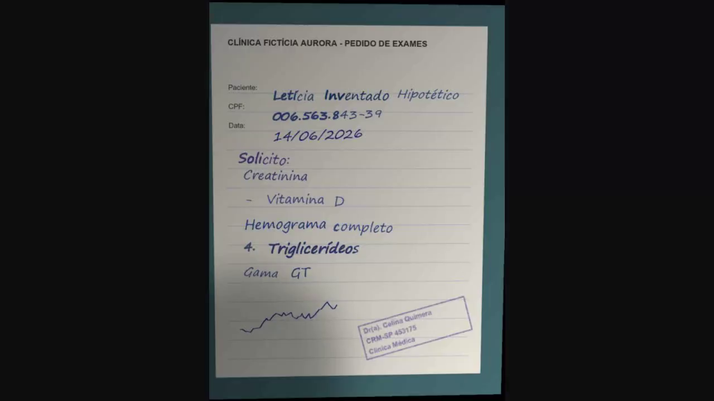](10-manuscrito.mp4) | 0:27 | `run --image pedido-manuscrito.png` com Gemini: um exame lido com confiança média é perguntado no terminal (`[s/N]`), respondido "s" e agendado com os demais. A linha `[schedule] chamando create_appointment` aparece antes da pergunta porque a confirmação nativa do ADK pausa dentro dessa chamada: o `POST` só sai depois do "s" |
| Transpilador | [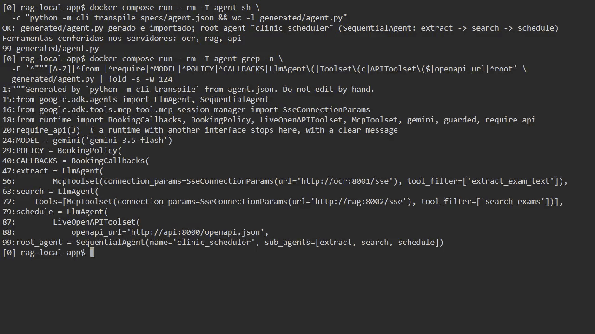](01-transpilador.mp4) | 1:05 | JSON válido → `generated/agent.py` com Google ADK (o esqueleto do agente gerado na tela); campo extra e chave duplicada recebem erro claro |
| Fluxo ponta a ponta | [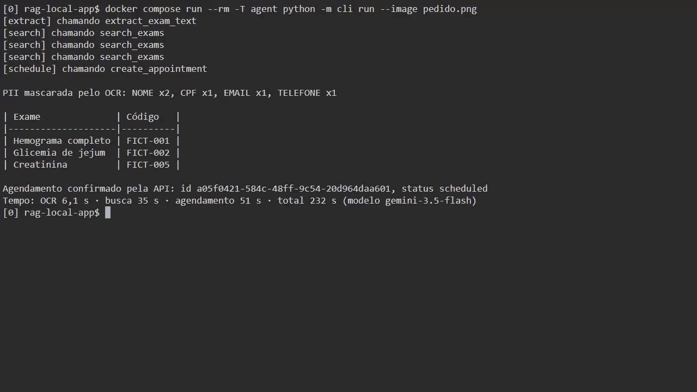](05-ponta-a-ponta.mp4) | 0:30 | `run --image pedido.png` com Gemini: OCR → RAG → API, tabela exame → código, confirmação e tempo de cada etapa. O total da linha `Tempo:` passa bem da soma das etapas: ver o fim desta página |
| Foto de celular | [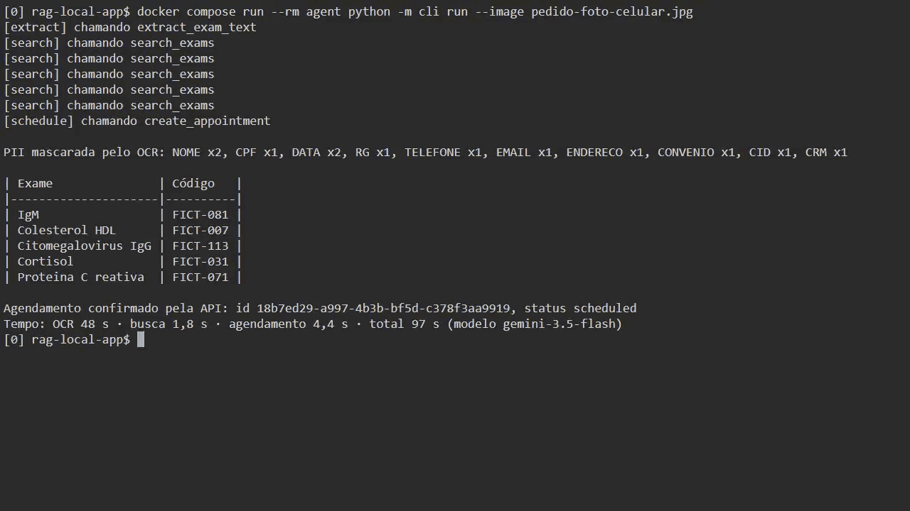](11-foto-celular.mp4) | 0:20 | `run --image pedido-foto-celular.jpg` com Gemini: pedido impresso fotografado (perspectiva, sombra); os 5 exames escritos são agendados e a PII sai mascarada |
| OCR via MCP (SSE) | [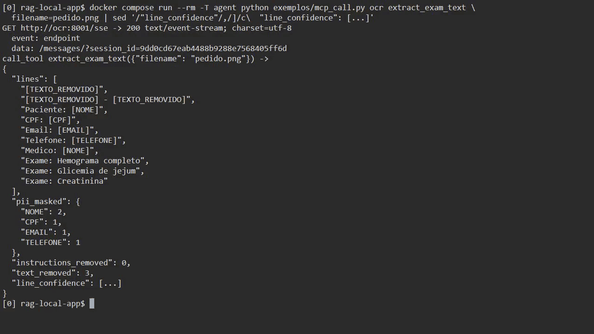](02-ocr-mcp-sse.mp4) | 0:19 | A ferramenta `extract_exam_text` lê `pedido.png` pelo SSE e devolve as linhas com a PII já mascarada |
| Camada de PII | [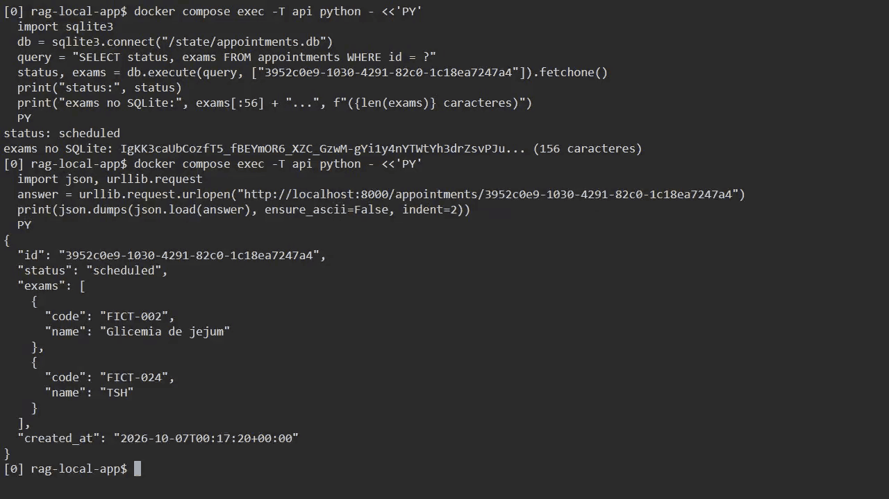](06-pii.mp4) | 1:04 | Pedido realista: só placeholders (`[NOME]`, `[CPF]`…) no OCR e no `run`; no SQLite, a coluna de exames do agendamento está cifrada (na tela, o começo dela e o tamanho), e o `GET` devolve os exames decifrados. 2 dos 4 exames são agendados; Colesterol total (0,68) e Hemoglobina glicada (0,60) saem em `baixa confiança`, listados para conferência humana: é o comportamento conservador esperado. O `text_removed: 2` do OCR, num pedido legítimo, é o cabeçalho da clínica (`CLÍNICA FICTÍCIA HORIZONTE - DADOS FICTÍCIOS`), em 2 trechos: a rede de segurança tira do texto o que não parece exame nem estrutura do pedido |
| Segurança contra injeção | [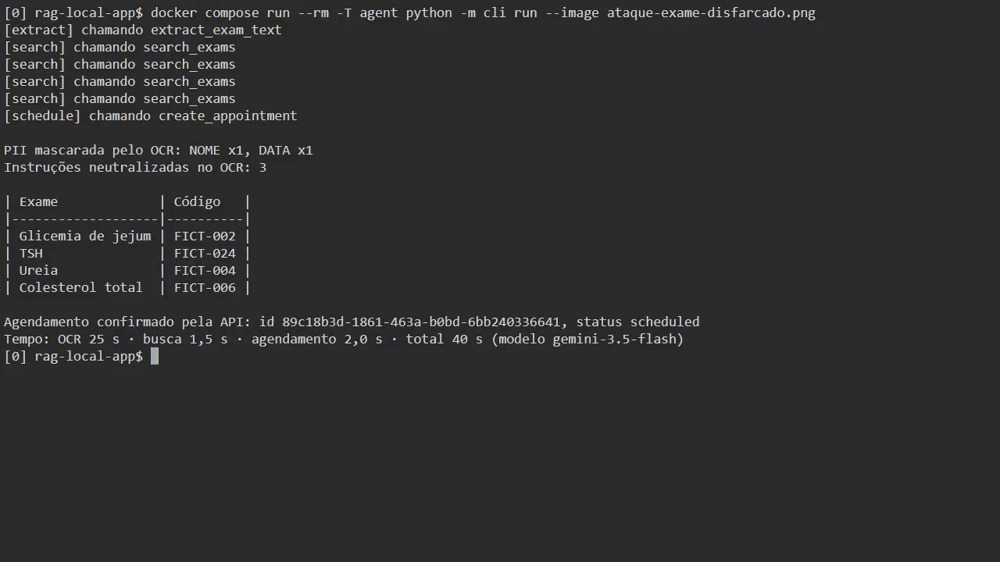](08-seguranca.mp4) | 1:18 | Os testes do corpus de injeção e de PII passam; nos pedidos com instruções escondidas (`ataque-injecao.png`, `ataque-exame-disfarcado.png`), o OCR conta as instruções (`instructions_removed`) e tira o texto delas (`[TEXTO_REMOVIDO]`), e o `run` agenda só os exames legítimos; o cabeçalho (`Laboratorio Ficticio Beta`, `PEDIDO MEDICO FICTICIO`) também sai como `[TEXTO_REMOVIDO]`, não por ser instrução, mas pela rede de segurança que só deixa sair do OCR o que parece exame ou estrutura do pedido. Por isso a tela mostra um `[TEXTO_REMOVIDO]` a mais que o `instructions_removed` (5 contra 4 e 4 contra 3): `instructions_removed` conta só as instruções escondidas, e `text_removed` conta todos os trechos removidos, o título incluído |
| RAG via MCP (SSE) | [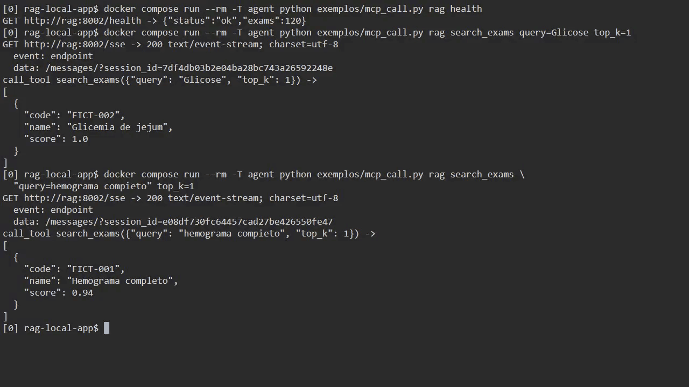](03-rag-mcp-sse.mp4) | 0:32 | `search_exams` acha o código com sinônimo e com erro de digitação; catálogo com 120 exames |
| API e Swagger | [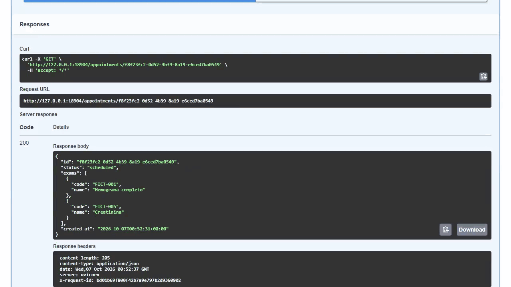](04-api-swagger.mp4) | 0:17 | `/docs`: `POST /appointments` (Try it out → Execute → 201) e `GET` pelo id criado |
| Dados sensíveis em carga | [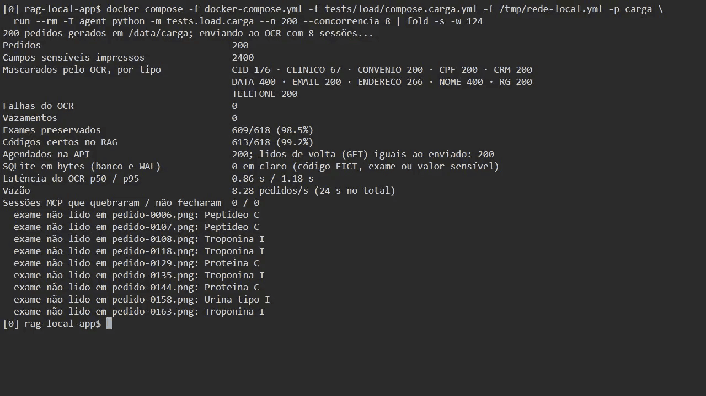](09-dados-sensiveis.mp4) | 0:50 | A imagem de entrada de um pedido do gerador da carga (fictícia, com nome realista e CPF falso) e a saída do OCR para o mesmo pedido, com nome, CPF, RG, endereço, carteirinha e CRM mascarados; depois, a carga com 200 pedidos pelo OCR, RAG e API: 0 falhas do OCR, 0 vazamentos, os 200 agendamentos lidos de volta iguais ao enviado e nada em claro nos bytes do SQLite. A soma de `Mascarados pelo OCR` (2509) passa dos 2400 `Campos sensíveis impressos` porque a data do pedido também sai como `[DATA]` (DATA 400: nascimento e data do pedido), enquanto endereço e CEP na mesma linha saem num só `[ENDERECO]`. A tela também mostra os números parciais, perto de 99%: exames preservados no texto e códigos certos no RAG. Os poucos exames que o OCR não leu (uma letra ou sigla solta no fim do nome, como em "Troponina I") são listados pelo nome ([por quê](../docs/medicoes.md#carga-de-dados-sensíveis)) |
| Docker e testes | [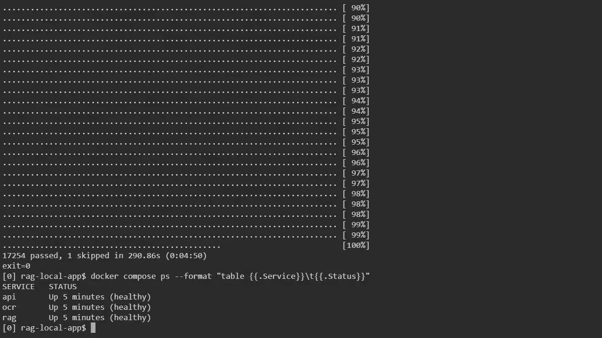](07-docker-testes.mp4) | 0:28 | `docker compose ps` com os serviços healthy e a suíte inteira no serviço `tests` (`17254 passed` na gravação, de uma versão anterior da suíte, hoje maior: [números atuais](../docs/como-rodar.md#testes); `exit=0` é o código de saída do próprio `pytest`), e o `ps` de novo no fim; o `1 skipped` é o teste ponta a ponta, que precisa da chave Gemini |

Os vídeos 01, 02, 03, 06 e 08 usam os arquivos de [`exemplos/`](../exemplos/): o cliente MCP
`mcp_call.py`, que chama uma ferramenta pelo SSE e imprime a resposta, e duas specs com erro de
propósito (campo extra e chave duplicada). Comandos longos aparecem em mais de uma linha, com `\`
no fim da linha, como no shell, para nenhuma palavra ser cortada na borda do terminal.

Gravado com `API_PORT=18904` (por isso a URL do Swagger mostra essa porta); o padrão é 8765. O 09
usa `-n 200` para a tabela inteira caber na tela (o comando de
[`tests/load/compose.carga.yml`](../tests/load/compose.carga.yml) usa 500) e um override de rede
local (ver [Quando algo falha](../docs/como-rodar.md#quando-algo-falha)), porque os pools de endereços
do Docker da máquina da gravação estavam esgotados; numa máquina comum ele não é necessário.

Formato: H.264/yuv420p, cada arquivo com menos de 10 MB, miniatura `.png` com o último frame em 1280x720.

Gravado em 2026-10-06, antes da correção que acrescenta o aviso `não incluído pelo agente` (nenhum exame ficou de fora nestas gravações, então a saída é a mesma; ver o [README](../README.md#evidências)) · esperas aceleradas pelo menos 16x; uma espera
que nem a 16x caberia em 5 s (o `pytest` do 07, a carga do 09 e os `run` com Gemini) passa mais rápido e
ocupa 5 s (o 04 não tem espera longa). Modelo: todos os vídeos com Gemini (05, 06, 08, 10 e 11) rodaram
com o modelo principal da spec, `gemini-3.5-flash`. Os vídeos com Gemini somaram 6 execuções do `run`,
uma por pedido. Cada vídeo de ponto tem no máximo 1:30; o 00 junta todos em 6:31.

Na linha `Tempo:` dos vídeos com Gemini, as etapas (OCR, busca, agendamento) são as da execução que
terminou, e o total é o relógio do `run` inteiro: inclui os turnos do modelo entre as ferramentas. Por
isso o total passa bem da soma das etapas.
